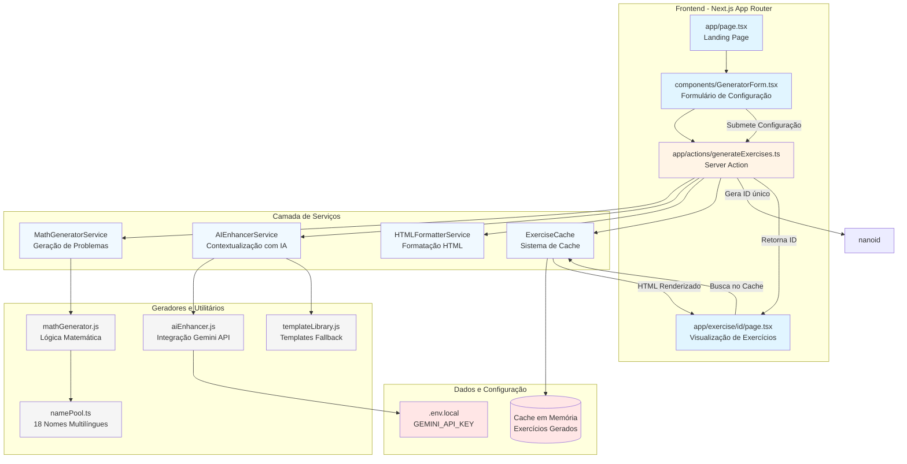
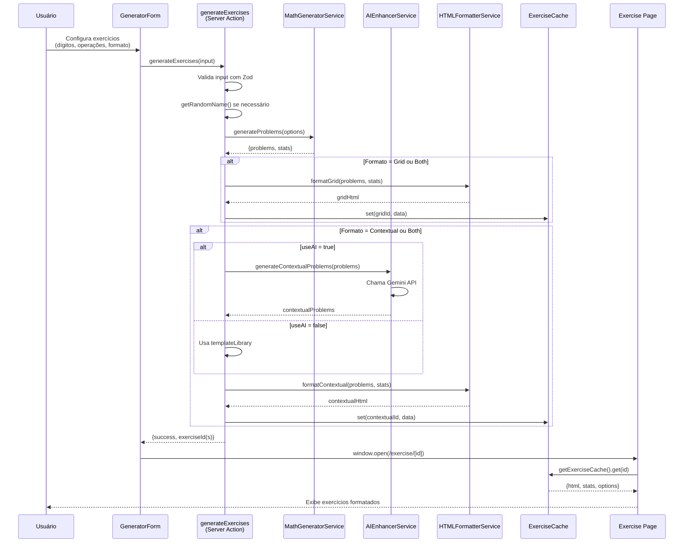
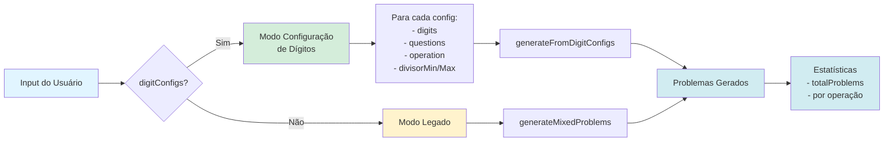
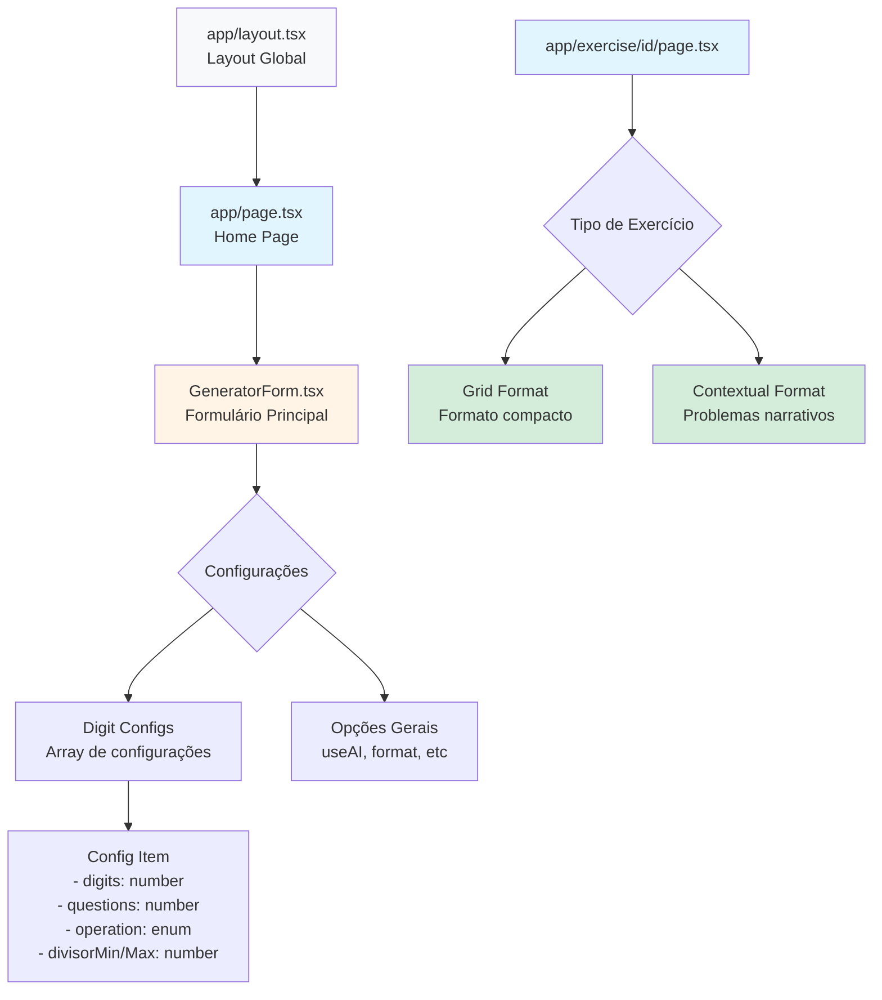

# 📐 Arquitetura do Sistema - Gerador de Exercícios de Matemática

## Visão Geral do Sistema

Este documento descreve a arquitetura completa do sistema de geração de exercícios matemáticos com IA.

## Diagrama de Arquitetura



## Fluxo de Geração de Exercícios



## Fluxo de Dados - Configuração de Dígitos



## Estrutura de Componentes



## Camadas do Sistema

### 1. Camada de Apresentação (Frontend)
- **Next.js 16** com App Router
- **React 19** com Server Components
- **TailwindCSS + DaisyUI** para estilização
- **Zod** para validação de formulários

### 2. Camada de Negócio (Services)
- **MathGeneratorService**: Orquestra geração de problemas matemáticos
- **AIEnhancerService**: Integração com Google Gemini API
- **HTMLFormatterService**: Formata saída em HTML pronto para impressão
- **ExerciseCache**: Cache em memória com TTL

### 3. Camada de Dados
- **Cache em memória**: Map com TTL de 24h
- **Gemini API**: Fonte externa para geração de contextos narrativos
- **Name Pool**: 18 nomes multilíngues (PT/EN)

## Tipos de Dados Principais

```typescript
// DigitConfig - Configuração por nível de dígitos
{
  digits: number,          // 1-5 dígitos
  questions: number,       // Quantidade de questões
  operation: Operation,    // Tipo de operação
  divisorMin?: number,     // Divisor mínimo (divisão)
  divisorMax?: number      // Divisor máximo (divisão)
}

// MathProblem - Problema individual
{
  num1: number,
  num2: number,
  operation: Operation,
  answer: number
}

// MathStats - Estatísticas dos exercícios
{
  totalProblems: number,
  additions: number,
  subtractions: number,
  multiplications: number,
  divisions: number
}

// CachedExercise - Exercício em cache
{
  type: 'grid' | 'contextual',
  html: string,
  stats: MathStats,
  options: GenerateExercisesInput
}
```

## Tecnologias e Dependências

### Principais
- **Next.js 16**: Framework React com SSR
- **React 19**: Biblioteca UI
- **TypeScript**: Type safety
- **Zod**: Schema validation
- **@google/generative-ai**: Integração Gemini
- **nanoid**: Geração de IDs únicos

### Dev Tools
- **Biome**: Linter e formatter
- **Jest**: Testes unitários
- **TailwindCSS**: Estilização

## Padrões de Arquitetura

1. **Server Actions**: Comunicação cliente-servidor type-safe
2. **Service Layer**: Separação de responsabilidades
3. **Cache Pattern**: Otimização de performance
4. **Factory Pattern**: Geração de problemas configurável
5. **Strategy Pattern**: Múltiplos formatos de saída

## Segurança e Performance

- **Server-side validation**: Zod schemas em Server Actions
- **Cache com TTL**: Evita consumo excessivo de memória
- **API Key protection**: Variáveis de ambiente (.env.local)
- **Error boundaries**: Tratamento robusto de erros
- **Rate limiting**: Controlado pela Gemini API

## Extensibilidade

O sistema foi projetado para fácil extensão:

1. **Novos tipos de operações**: Adicionar em `Operation` enum
2. **Novos formatos**: Implementar em `HTMLFormatterService`
3. **Novas fontes de IA**: Abstrair `AIEnhancerService`
4. **Novos idiomas**: Expandir `namePool.ts`
5. **Persistência**: Substituir cache em memória por DB

## API Routes

```
GET  /                        - Landing page com formulário
POST /actions/generateExercises - Server Action (geração)
GET  /exercise/[id]           - Visualização de exercício
GET  /api/cache               - API de gerenciamento de cache
```

---

**Última atualização**: Janeiro 2026  
**Versão**: 0.1.0
